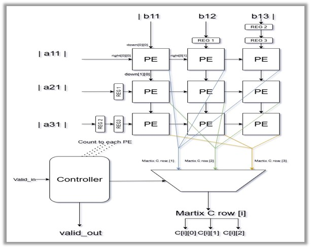
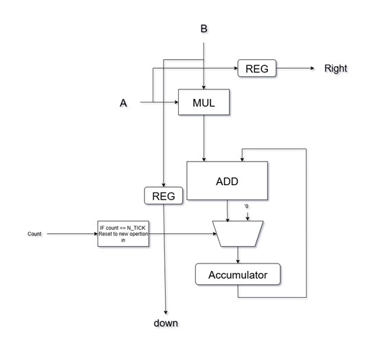
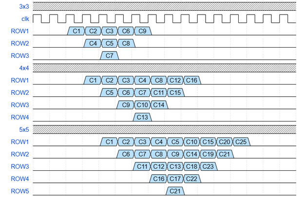
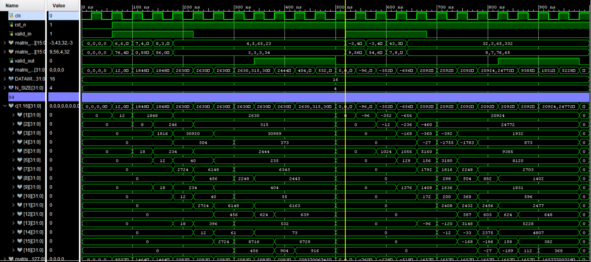

# Systolic Array for Applying Matrix Multiplication
This repository contains a parameterized SystemVerilog implementation of an N_SIZE x N_SIZE systolic array designed for efficient matrix multiplication, The design includes a configurable array size (`N_SIZE`) and data width (`DATAWIDTH`). The design supports configurable data widths and includes RTL code, a comprehensive testbench, and a detailed report with architecture diagrams, simulation waveforms, and logs. The architecture is scalable, synchronized with clock and reset signals, and optimized for high-performance applications such as AI accelerators.

---

## About

Language: `SystemVerilog`

Features: Scalable `N_SIZE`, configurable `data width`, clock/reset synchronization, pipelined architecture

Documentation: Includes a report with diagrams, waveforms, and logs

### Systolic Overview
Systolic arrays are specialized parallel computing architectures designed to perform efficient, pipelined computations, particularly for matrix operations. The term "systolic" draws from the biological analogy of the heart's rhythmic contractions, reflecting the synchronized, rhythmic flow of data through a grid of processing elements (PEs). This section introduces the concept of systolic and semi-systolic architectures, focusing on their application in 1D vector multiplication and the role of retiming in optimizing circuit performance for hardware implementations.

- For a detailed exploration, refer to the full report.

---

## Architecture

The top-level architecture of the systolic array design integrates multiple 
submodules to perform efficient parallel matrix multiplication. The 
“systolic_array” module acts as the main controller, interfacing with input 
matrices, coordinating data movement across a grid of processing elements 
(PEs), and producing the output matrix. Key subcomponents include the PE 
array, a control unit (Controller), and a multiplexer (mux_out) for selecting the 
appropriate result. The design is fully parameterized to support scalable 
matrix sizes and data widths.



### PE 

Each Processing Element (PE) in the systolic array performs the fundamental 
multiply-accumulate (MAC) operation. As shown in the figure, it takes one 
input A from the left and one input B from the top. These inputs are first 
registered to allow pipelined dataflow and then multiplied. The multiplication 
result is added to an internal accumulator which stores the partial sum. A 
control signal count determines when the accumulator should reset 
(specifically when count == N_TICKS, indicating the end of the current matrix 
operation). The result of the addition is fed back into the accumulator on the 
next clock cycle. Simultaneously, the registered values of A and B are passed 
to the right and bottom neighboring PEs respectively, enabling data 
propagation across the array. This design supports full pipelining and 
contributes to a regular and scalable architecture ideal for matrix 
multiplication.



---

## Parameterized Latency



Latency of one operation is 3 * N_SIZE-2

---

## Waveform
Run `systolic_array_tb`



- For a detailed exploration, refer to file.log txt file.

---

## 📁 Directory Structure

```text
Systolic-Array-for-Applying-Matrix-Multiplication/
├── README.md
├── Doc/
│   ├── file.log
│   └── Systolic Array for Applying Matrix Multiplication.pdf
├── MATLAB Matrix Mul (NXN)/
│   └── matlabmatrixmul.m
├── RTL/
│   ├── Controller.sv
│   ├── matrix_sep.sv
│   ├── mux_out.sv
│   ├── PE.sv
│   └── systolic_array.sv
└── Testbench/
    ├── PE_tb.sv
    └── systolic_array_tb.sv
```

---

> 🎓 References:
> - STMicroelectronics: LAB 0 Systolic Array for Applying Matrix 
Multiplication Specs, Ahmed Abdelsalam
> - COMPUTER ARITHMETIC Algorithms and Hardware Designs SECOND 
EDITION, Behrooz Parhami  
